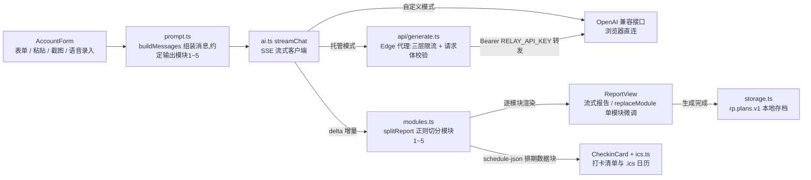

# 返青计划 · 断更账号重启与陪伴工具

[](https://github.com/wjh941/fanqing-plan/actions/workflows/e2e.yml) [](https://github.com/wjh941/fanqing-plan/actions/workflows/deploy-pages.yml) [](https://react.dev) [](https://vitejs.dev) [](https://www.typescriptlang.org)

> 冬天的麦苗会枯黄,但根还活着——开春,就返青了。
> **不保证流量,只保证你不再是一个断更的人。**

面向「断更后想重启」的小红书 / 抖音个人博主的网页工具:AI 生成重启诊断、选题、双平台文案、更新排期与复盘,可选变现路径,陪用户从发出第一篇到 30 天重启完成。打开即用,无需注册与配置;数据只存浏览器本地。

**线上地址:https://fanqing-plan.vercel.app** · 备用线路(GitHub Pages):https://wjh941.github.io/fanqing-plan/

产品主张:**生成方案只是门票,陪跑才是产品**。两条主线——「首发模式」陪用户发出第一篇(获客与口碑),「返青第 N 天 + 30 天总结」陪用户坚持到重启完成(留存)。

> ⚠️ 定位是内容策略辅助工具,不是流量外挂:不承诺恢复权重、提升播放、涨粉、上热门;方案仅供参考,无法干预平台算法。

## 功能特性

### 两条使用路径

| 路径 | 耗时 | 适合场景 | 做什么 |
| --- | --- | --- | --- |
| **完整方案** | 约 3 分钟 | 想要一份完整重启计划 | 填写账号赛道人设、断更时长、历史作品数据,AI 按以下 5 个模块生成一份完整、低压力的重启方案 |
| **快速诊断** | 约 1 分钟 | 作品只有 1~2 条 | 先拿轻量初判(有效方向 + 第一周建议 + 今天 10 分钟的一件小事) |

完整方案按 5 个模块依次输出:


| 模块 | 交付内容 |
| --- | --- |
| 1. 账号重启诊断报告 | ⚡30 秒速览 + 历史有效标签 / 失效与风险标签 / 流量下滑归因 / 重启策略 / 起步更新强度 |
| 2. 专属重启选题池 | 5 个低竞争长尾选题(简介 + 适配理由 + 避雷点) |
| 3. 内容成品物料 | 小红书笔记(3 标题 + 正文 + 钩子 + 引导 + 标签)+ 抖音口播脚本(含画面思路) |
| 4. 渐进式更新排期计划 | 第 1 周逐日小任务(前 2 天不发布)+ 时间预算 + 完成标准,测试期 → 小幅加量 → 稳步提升 |
| 5. 轻量化复盘指引 | 只看关键信号,含「数据不好时怎么调整」的心态安抚与前 3 篇预期管理 |

### 生成前 · 降低门槛

| 能力 | 说明 |
| --- | --- |
| **首次访问引导** | 三句话讲清工具定位与数据安全,一条路径直达演示 |
| **赛道模板库** | 家居好物、美妆、穿搭等 10 大常见赛道,一键填入人设描述 |
| **定位迷茫模式** | 「我还没想清楚定位」勾选后,赛道&人设变为选填,并提供三问小助手(发得最多什么 / 观众夸什么 / 职业背景)帮拼定位;AI 会在诊断报告里「从数据反推」2~3 个可选定位方向,并推荐先按哪个跑 4 周实验 |
| **变现路径模块(可选)** | 「我想知道后续怎么变现」勾选后,方案追加模块 6——按重启期 / 标签稳定后 / 数据成熟后三阶段给合规变现建议与避坑提示,不承诺收益 |
| **语音输入** | 赛道人设、重启目标支持浏览器语音识别(Chromium/Safari);不可用时自动引导用手机键盘的语音转文字 |
| **示例一键填充** | 没想法时先填示例账号,体验完整流程 |
| **草稿自动保存** | 填一半关掉页面,下次打开还在 |

**四种作品录入方式,按顺手程度自选:**

1. **粘贴导入(主路径)**:创作者中心表格整段复制粘贴,自动拆条——TSV/Excel/markdown 表格(带表头自动对列、无表头按数量级猜列)+ 每行一条随手记(赞/藏/播关键词与斜杠写法)
2. **读取剪贴板**:一键读入剪贴板内容,省去 Ctrl+V
3. **截图识别导入**:上传创作者中心截图(支持多张、手机相册),视觉模型自动提取作品列表(需配置支持看图的模型,如 gpt-5.5 / gpt-4o)
4. **手动加一条**:表单卡片,只有标题必填

### 生成中 · 减少焦虑

| 能力 | 说明 |
| --- | --- |
| **流式分模块渲染** | 逐模块浮现 + 骨架屏 + 打字光标,自动跟随滚动(用户上翻即停止) |
| **随时停止** | 已生成的部分保留可用 |

### 生成后 · 帮助执行,防再断更

| 能力 | 说明 |
| --- | --- |
| **首发模式** | 不生成方案、不用 AI,三步陪用户发出第一篇——给旧作品办退休(设为私密+轻松文案)→ 三套低风险首发模板自动生成正文(回归碎碎念 / 五步清单 / 旧作翻新)→ 发布打卡;完成即得「返青第 1 天」可下载纪念图(Canvas 本地生成,传播素材) |
| **重启打卡清单** | AI 排期自动转成可勾选清单(第 1 周逐日、每条含时间预算与完成标准),返青开始日自选,具体日期落到每条任务,可导出 .ics 日历 |
| **复盘三问** | 数据不理想时,三道选择题自动生成「下一篇只改一个变量」的实验,可一键加回清单(纯本地规则) |
| **预期管理** | 前 3 篇"数据差是常态"提前说好,建议 24 小时后再看数据;「今天没状态?降档」一键加入极简维持任务 |
| **返青足迹(只累计,不清零)** | 累计完成动作数、本月完成次数、返青第 N 天;第 31 天起自动变为「重启完成」总结卡 + 可下载总结图 |
| **轻量数据记录 + 基准线趋势** | 勾选后可顺手记播放/赞/藏,自动以第一条为基准线给出温和的趋势提示(纯本地计算,不承诺效果) |
| **完整备份/恢复** | 历史方案页一键导出全量 JSON(方案+打卡+草稿,不含 Key),换设备一键恢复;完成 2 个动作后温和提醒备份一次 |
| **追问微调** | 对单个模块提要求(如"选题不要出镜"),只重写该模块 |
| **悬浮目录导航** | 长报告快速跳转任意模块 |
| **复制与导出** | 单模块复制、整份复制、导出 Markdown、打印/存 PDF |
| **历史方案本地保存** | 回看、继续打卡与微调、删除 |
| **生成失败一键重试** | 错误原因用人话说明(401/402/429 等) |

### 信任与合规

| 能力 | 说明 |
| --- | --- |
| **免 Key 托管生成(默认)** | 访客无需注册与 Key 直接生成,由 Vercel Edge Function 站内代理转发——Key 只存服务端环境变量;三层限流(每 IP 每日 12 次 / 每小时 5 次突发 / 全站每日 300 次封顶),请求体与 token 上限服务端锁定,固定模型 |
| **自定义接口(高级)** | 设置里切换,浏览器直连任意 OpenAI 兼容接口,Key 只存本机 |
| **隐私三段式说明** | 本机保存什么 / 生成时转发什么 / 自定义接口的路径,全部透明 |
| **演示模式** | 内置示例数据体验完整流程(含模块 6) |
| **合规内置** | 系统提示词固化硬性禁止事项(不承诺效果、不推荐擦边内容、不做绝对化断言),输出末尾强制免责声明,前端页脚常驻 |
| **线上诊断** | 加载/渲染错误屏幕红条直接显示(含 React 组件栈、包指纹),远程报错截图即可定位 |
| **SEO 与分享** | robots.txt / sitemap.xml / OG 与 Twitter 分享卡 + 1200×630 分享图,微信/群聊转发出正式卡片 |
| **PWA** | 可添加到手机主屏,像 App 一样打开 |

## 内部逻辑

### 目录结构

```text
api/generate.ts               # Vercel Edge Function 生成代理:服务端读 RELAY_* Key,三层限流 + 请求体校验 + 流式转发
.github/workflows/            # e2e.yml CI(strict 类型检查 → 构建 → Playwright E2E)· deploy-pages.yml 构建部署 GitHub Pages
scripts/smoke.mjs             # 生产包冒烟测试:jsdom 挂载 dist 产物,捕获 React 渲染错误
src/
  App.tsx                     # 状态编排:生成 / 停止 / 微调 / 历史
  lib/
    types.ts                  # 类型与模块元数据
    prompt.ts                 # 系统提示词(5 模块规则 + 硬性禁止)+ 消息构建
    ai.ts                     # OpenAI 兼容流式客户端(SSE 解析、错误映射、测试连接)
    modules.ts                # AI 输出解析:模块切分 / 抽取排期 / 替换单模块
    parser.ts / vision.ts / speech.ts   # 历史作品智能粘贴解析 / 截图识别导入 / 语音识别封装
    storage.ts                # localStorage:配置 / 草稿 / 历史方案 / 打卡
    journey.ts                # 陪跑数据层:首发记录、累计完成、返青第 N 天
    ics.ts / backup.ts        # 排期落日期导出 .ics 日历 / 全量备份恢复 JSON(不含 Key)
    niches.ts                 # 常见赛道模板库,一键填入
    export.ts                 # Markdown 导出与剪贴板
    demo.ts                   # 演示数据(内置完整示例方案)
  components/
    ui.tsx                    # 基础组件(Button/Card/Dialog/Toast/Markdown…)
    AccountForm.tsx           # 三步向导 + 智能粘贴
    ReportView.tsx            # 流式报告 + 复制/导出 + 微调
    FirstPostMode.tsx         # 首发模式:不走 AI,三步发出第一篇
    CheckinCard.tsx           # 打卡清单 + 复盘三问(纯本地规则)
    HistoryDrawer.tsx         # 历史方案回看 / 继续打卡 / 删除
    SettingsDialog.tsx        # 生成方式设置(托管 / 自定义接口)
    InfoDialogs.tsx           # 首次访问引导 + 隐私与免责说明
    MicButton.tsx / ResumeBanner.tsx    # 语音输入按钮 / 回访唤醒横幅
```

### 生成数据流



### 关键机制

- **AI 调用统一走 `src/lib/ai.ts` 的 `streamChat`(SSE 流式)**:托管模式 POST 到同源(或 `VITE_MANAGED_API_BASE` 指向的)`/api/generate` Edge Function,Key 只存服务端环境变量 `RELAY_BASE_URL` / `RELAY_API_KEY` / `RELAY_MODEL`(`api/generate.ts`);自定义模式浏览器直连用户填的 OpenAI 兼容接口,`.env.local` 的 `VITE_AI_BASE_URL` / `VITE_AI_API_KEY` / `VITE_AI_MODEL` 只作为本地默认值注入(`src/lib/storage.ts` 的 `DEFAULT_CONFIG`)。
- **失败与降级**:用户停止或流中断时 `streamChat` 返回已收到的部分、不抛错;401/402/422/429 由 `friendlyError` 映射成人话提示;代理内置三层内存限流(每 IP 每日 12 次 / 每小时突发 5 次 / 全站每日 300 次,`overLimit`),超限返回 429 并引导切换自定义接口。
- **生成结果只落浏览器 localStorage**:配置 `rp.aiConfig.v1` / 草稿 `rp.draft.v1` / 历史方案 `rp.plans.v1`(上限 30 份)/ 打卡 `rp.checklist.v1`(`src/lib/storage.ts`),陪跑足迹另存 `rp.firstPost.v1`(`src/lib/journey.ts`);备份导出的 JSON 只打包 plans/checklist/draft 三个键、刻意不含 Key(`src/lib/backup.ts`)。
- **AI 输出是约定格式的 markdown,靠正则解析**:`prompt.ts` 的 `SYSTEM_PROMPT` 强制 `### 模块N:` 标题与 `schedule-json` 围栏排期数据块,`modules.ts` 据此切分模块 1~5(可选 6)、把排期 JSON 转成打卡清单,并支持 `replaceModule` 只重写单个模块。
- **质量门**:推送 main 触发两条 workflow——`e2e.yml`(strict 类型检查 → 构建 → Playwright E2E)与 `deploy-pages.yml`(注入 `VITE_MANAGED_API_BASE` 构建 GitHub Pages);改动后可 `node scripts/smoke.mjs` 在 jsdom 里挂载 dist 做运行时冒烟。

## 快速开始

1. 克隆仓库并安装依赖:

   ```bash
   git clone https://github.com/wjh941/fanqing-plan.git
   cd fanqing-plan
   npm install
   ```

2. 启动开发服务器:

   ```bash
   npm run dev
   ```

3. 打开 http://localhost:5199(同一局域网手机可访问启动时打印的 Network 地址)。

## 配置 AI(默认免配置,开箱即用)

**托管生成(默认)**:访客无需注册、无需 Key,直接生成。由 `api/generate.ts`(Vercel Edge Function)代理 AI 接口——Key 只存在服务端环境变量,前端产物不含任何密钥;内置每 IP 每日 12 次限流与请求体校验。

**自定义接口(高级)**:「设置」→「生成方式」→「自定义接口」,填入任意 OpenAI 兼容接口的 Key(DeepSeek 或中转,中转地址一般要带 `/v1`),无次数限制,浏览器直连。本地开发可在 `.env.local` 里预填 `VITE_AI_*` 作为默认值。

**部署拓扑**:Vercel 部署自带 `/api` 函数,托管走同源;GitHub Pages 为纯静态,构建时注入 `VITE_MANAGED_API_BASE` 指向 Vercel 函数(该线路依赖 vercel.app 可达性,大陆部分手机网络可能不稳)。推理类模型生成前会有一段不可见的"思考时间",骨架屏属正常。

| 配置项 | 配置位置 | 说明 |
| --- | --- | --- |
| `RELAY_BASE_URL` / `RELAY_API_KEY` / `RELAY_MODEL` | 服务端环境变量(Vercel) | 托管代理 `api/generate.ts` 所需;Key 不进入前端产物,固定模型 |
| `VITE_AI_*` | 本地 `.env.local` | 本地开发时预填自定义接口的默认值 |
| `VITE_MANAGED_API_BASE` | 构建时注入 | GitHub Pages 纯静态部署时,指回 Vercel 托管函数地址 |

## 打包部署

```bash
npm run build   # 产物在 dist/,纯静态,可直接托管到 Vercel / Netlify / 任意静态服务器
npm run preview # 本地预览构建产物
```

- **部署说明**:GitHub Pages 构建需带 `GITHUB_PAGES=1` 环境变量(切换相对路径 base),见 `.github/workflows/deploy-pages.yml`;改动后可用 `node scripts/smoke.mjs` 对生产包做运行时冒烟测试;临时设 `PAGES_DEBUG=1` 可构建非压缩包用于线上诊断(页面红条会显示完整组件栈)。
- **CORS**:如部署到其他域名,DeepSeek 的 CORS 会自动回显来源,无需额外配置;若使用不支持 CORS 的第三方接口,可把接口地址填为你自己的中转服务。

| 构建配置 | 说明 |
| --- | --- |
| `GITHUB_PAGES=1` | GitHub Pages 构建时切换相对路径 base |
| `PAGES_DEBUG=1` | 构建非压缩包,用于线上诊断 |

## 技术栈

React 19 · Vite 6 · TypeScript · Tailwind CSS v4(@tailwindcss/typography)· framer-motion · lucide-react · react-markdown + remark-gfm
